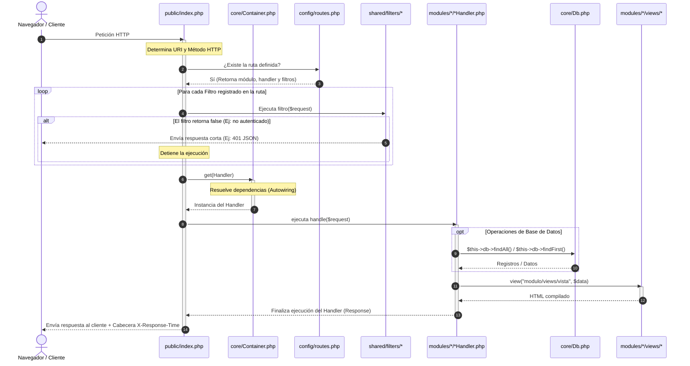

# ⚡ WTF

**WTF** (What the Framework!) es un micro-framework de PHP ultraliviano y de alto rendimiento, diseñado para desarrolladores que valoran la simplicidad, la arquitectura limpia y los despliegues modernos. Cuenta con soporte nativo para el **Modo Worker de FrankenPHP** y una integración optimizada con SQLite3.

Sin dependencias pesadas ni la sobrecarga de Composer. Solo PHP puro, limpio y extremadamente rápido.

---

## 🛠️ Inicio Rápido

Ejecuta tu entorno de desarrollo en segundos.

### Requisitos Previos
- PHP 8.1 o superior (con las extensiones `pdo_sqlite` y `openssl` activas)
- [Caddy](https://caddyserver.com/) con el plugin de FrankenPHP (opcional, pero recomendado para producción)
- php-curl (opcional, sólo necesario si vas a usar la herramienta pinger)

### Servidor de Desarrollo Local (Tradicional)

Si deseas ejecutar la aplicación de forma rápida con el servidor de desarrollo integrado de PHP:

```bash
php -S localhost:8080 -t public
```

### Ejecutar con FrankenPHP (Modo Worker)

Si tienes FrankenPHP instalado localmente, puedes aprovechar la ejecución persistente (Worker Mode) para máximo rendimiento:

```bash
frankenphp run --config Caddyfile
```
*La aplicación estará disponible de inmediato en [http://localhost:8080](http://localhost:8080).*

### 💻 Herramientas de Consola (CLI)

El framework incluye herramientas de terminal autoejecutables para mejorar el flujo de desarrollo:

* **Listar Rutas**: Muestra una tabla ASCII coloreada con todas las rutas registradas y sus filtros.
  ```bash
  ./bin/console
  ```
* **Andamiaje (Scaffold)**: Lee un archivo CSV y genera automáticamente las carpetas de módulos, Handlers (starters) y Vistas correspondientes, además de registrar las rutas en `config/routes.php`.
  ```bash
  ./bin/scaffold routes.csv
  ```
* **Verificador de URLs (Pinger)**: Realiza pruebas automáticas de HTTP request sobre tus endpoints leyendo configuraciones y códigos de estado esperados desde un archivo CSV.
  ```bash
  ./bin/pinger pruebas.csv http://localhost:8080
  ```
* **Guardián (Linter y Análisis Estático)**: Valida la sintaxis de todos los archivos PHP, comprueba que los Handlers no emitan HTML directamente (forzando el uso de `view()`), y valida la adherencia estricta del patrón CQRS en los modelos (`shared/models/`).
  ```bash
  ./bin/guardian
  ```

---

## 📂 Estructura del Proyecto

El diseño del proyecto es modular y fácil de navegar:

```text
├── bin/                 # Herramientas de consola CLI
│   ├── console          # Ejecutable para listar rutas
│   ├── console.php      # Script principal de listado de rutas
│   ├── guardian         # Ejecutable para análisis estático y linter
│   ├── guardian.php     # Script principal del linter / CQRS
│   ├── pinger           # Ejecutable para validar endpoints
│   ├── pinger.php       # Script principal del verificador de URLs (pinger)
│   ├── scaffold         # Ejecutable para andamiaje
│   └── scaffold.php     # Script principal de andamiaje de módulos y vistas
├── config/              # Configuración global del sistema
│   ├── database.php     # Configuración de base de datos
│   ├── dependencies.php # Mapeo de dependencias para el Contenedor DI
│   ├── routes.php       # Registro y definición de rutas URL
│   └── settings.php     # Ajustes de PHP, zonas horarias y rutas base
├── core/                # El motor del framework (DB Singleton, Cookies encriptadas, etc.)
│   ├── interfaces/      # Interfaces comunes del framework
│   │   └── HandlerInterface.php
│   ├── bootstrap.php    # Autocarga de clases, utilidades HTTP y helpers de renderizado
│   ├── Container.php    # Contenedor de Inyección de Dependencias con Autowiring
│   ├── Db.php           # Servicio PDO para SQLite3 con optimizaciones agresivas
│   ├── EncryptedCookie.php # Gestor de cookies seguras y encriptadas (AES-256-GCM)
│   └── Response.php     # Clase que encapsula respuestas HTTP (cuerpo, cabeceras, estado)
├── modules/             # Lógica de negocio y vistas organizadas por módulos
│   └── home/            # Módulo de la página de inicio
│       ├── HomeHandler.php # Controlador del módulo (implementa HandlerInterface)
│       └── views/
│           └── index.php   # Plantilla HTML/PHP para la vista del módulo
├── public/              # Directorio público (única raíz expuesta a la web)
│   ├── .htaccess        # Reglas de reescritura para Apache
│   └── index.php        # Controlador frontal y bucle de peticiones de FrankenPHP
├── shared/              # Recursos compartidos entre diferentes módulos
│   ├── filters/         # Filtros de ruta (Middlewares globales/específicos)
│   ├── models/          # Modelos compartidos (cargados automáticamente)
│   └── templates/       # Templates HTML globales (default.php, etc.)
├── Caddyfile            # Configuración de servidor web para FrankenPHP
└── README.md            # Este manual de experiencia de desarrollador
```

---

## 🔄 Flujo de una Petición (Request Lifecycle)

Visualización de cómo viaja una petición HTTP a través del framework:



---

## ⚙️ Guía de Desarrollo: Cómo hacer cosas comunes

### 1. Registrar una nueva ruta

Las rutas se definen como un arreglo asociativo en [config/routes.php](./config/routes.php):

```php
return [
    '/' => [
        'module' => 'home',
        'starter' => 'HomeHandler',
        'filters' => [],
        'description' => 'Página de Inicio'
    ],
    '/dashboard' => [
        'module' => 'dashboard',
        'starter' => 'DashboardHandler',
        'filters' => ['auth'], // Aplica el filtro shared/filters/auth.php
        'description' => 'Panel de control seguro'
    ],
];
```

### 2. Crear un Handler (Controlador)

Cada ruta mapea a una clase "starter" ubicada en `modules/{nombre_modulo}/{NombreHandler}.php`. Debe tener un método `handle(array $request)`.

Ejemplo de `DashboardHandler.php`:

```php
<?php

class DashboardHandler {
    public function handle(array $request): Response
    {
        // $request contiene: method, path, headers, query, body, params, start_time
        
        $data = [
            'titulo' => 'Mi Tablero de Control',
            'usuario' => ['nombre' => 'Nelson']
        ];
        
        return view("dashboard/views/index", $data);
    }
}
```

### 3. Crear y aplicar Filtros (Middlewares)

Los filtros se ejecutan antes del handler. Si retornan `false`, abortan la petición. Se guardan en `shared/filters/{nombre_filtro}.php` y la función declarada dentro debe tener el mismo nombre que el archivo.

Ejemplo en [shared/filters/auth.php](./shared/filters/auth.php):

```php
<?php

function auth(array $request): mixed {
    $session = EncryptedCookie::get('wtf_session');
    
    if (!$session) {
        return json(['error' => 'No autorizado'], 401); // Retorna una Response para abortar
    }

    return true; // Continúa al handler
}
```

### 4. Consultas a la Base de Datos (`Db` Service)

La clase [core/Db.php](./core/Db.php) se utiliza como un servicio instanciable registrado en el contenedor DI. Puedes inyectar `Db` en el constructor de tus controladores o modelos y usar sus métodos rápidos:

```php
// Inyección de dependencia en el constructor de tu clase
private Db $db;

public function __construct(Db $db) {
    $this->db = $db;
}

// 1. Obtener múltiples registros
$usuarios = $this->db->findAll("SELECT * FROM users WHERE active = :active", ['active' => 1]);

// 2. Obtener un único registro (retorna array asociativo o null)
$usuario = $this->db->findFirst("SELECT * FROM users WHERE id = :id", ['id' => 12]);

// 3. Insertar un registro (retorna el ID de la fila insertada)
$nuevoId = $this->db->insert("users", [
    'name' => 'Nelson Rojas',
    'email' => 'nelson@example.com',
    'created_at' => date('Y-m-d H:i:s')
]);

// 4. Actualizar registros (requiere condición WHERE para evitar updates masivos accidentales)
$filasAfectadas = $this->db->update(
    "users",
    ['name' => 'Nelson R.'], // Datos a cambiar
    "WHERE id = :id",        // Condición
    ['id' => $nuevoId]       // Parámetros
);

// 5. Eliminar registros
$filasEliminadas = $this->db->delete("users", "WHERE id = :id", ['id' => $nuevoId]);
```

### 5. Contenedor de Inyección de Dependencias (`Container`)

WTF incluye un contenedor de inyección de dependencias (`Container`) ligero con soporte nativo de **Autowiring** (resolución automática usando reflexión).

#### Registrar Dependencias de forma manual
Define tus servicios compartidos y singletons en [config/dependencies.php](./config/dependencies.php):

```php
return function (Container $container) {
    // Registrar Db como Singleton
    $container->singleton(Db::class, function ($c) {
        return new Db();
    });
};
```

#### Uso mediante Autowiring (Sin configuración)
Cualquier clase instanciable (Handlers, Modelos, Servicios) que declares en los constructores de tus clases será resuelta automáticamente por el contenedor sin necesidad de registro explícito.

```php
class HomeHandler implements HandlerInterface {
    private UserQuery $userQuery;

    // El contenedor resuelve e inyecta UserQuery automáticamente
    public function __construct(UserQuery $userQuery) {
        $this->userQuery = $userQuery;
    }

    public function handle(array $request): Response {
        $users = $this->userQuery->getActiveUsers();
        return view("home/views/index", ['users' => $users]);
    }
}
```

### 6. Cookies Encriptadas (Seguridad)

Para almacenar sesiones de usuario u otros datos sensibles del lado del cliente, se utiliza criptografía AES-256-GCM.

> [!IMPORTANT]
> Recuerda cambiar la clave secreta estática `$secret_key` en [core/EncryptedCookie.php](./core/EncryptedCookie.php) antes del despliegue a producción.

```php
// Guardar datos de sesión encriptados (expira en 24 horas, HttpOnly, SameSite=Lax)
EncryptedCookie::set('wtf_session', [
    'user_id' => 42,
    'role' => 'admin'
], 86400);

// Leer cookie encriptada (valida expiración y firma; si fue alterada retorna null)
$session = EncryptedCookie::get('wtf_session');
if ($session) {
    $userId = $session['user_id'];
}

// Destruir cookie de sesión
EncryptedCookie::destroy('wtf_session');
```

### 6. Renderizado de Vistas y Escapado (Protección XSS)

- Usa la función global `view()` para cargar plantillas PHP/HTML.
- Usa el helper rápido `h()` para escapar datos generados por el usuario y mitigar ataques XSS.
- Divide tus vistas en bloques reutilizables usando la función `partial()`.

**Archivo de vista (`modules/home/views/index.php`)**:
```html
<header>
    <?php partial('navbar', ['active' => 'home']); ?>
</header>

<main>
    <!-- h() escapa de forma segura el texto -->
    <h1>Bienvenido, <?= h($usuario['nombre']) ?>!</h1>
</main>
```

---

## ⚡ Funcionamiento en Modo Worker de FrankenPHP

Cuando WTF se ejecuta bajo FrankenPHP en modo Worker, el ciclo de vida cambia drásticamente respecto al CGI/FPM tradicional para conseguir rendimientos extremos:

1. **Compilación única**: PHP arranca el worker, compila todos los scripts de soporte, carga las clases comunes del autoloader y mantiene todo en la memoria RAM del proceso.
2. **Bucle persistente**: Las peticiones HTTP entrantes son despachadas directamente a la función callback de `frankenphp_handle_request` en `public/index.php`.
3. **Limpieza de Estado**: Al final de cada petición HTTP procesada, el framework realiza una limpieza explícita (`unset` de handlers, headers, variables locales y reseteo de superglobals como `$_GET`, `$_POST`, etc.) para evitar fugas de memoria o contaminación de datos entre diferentes usuarios.
4. **Reciclado Automático**: Para mitigar cualquier fuga menor de memoria en tus handlers, los workers se destruyen y recrean automáticamente cada `MAX_REQUESTS` (10,000 peticiones por defecto).

---

## 📄 Licencia

Este proyecto está bajo la Licencia MIT. Consulta el archivo [LICENSE](LICENSE) para más detalles.
